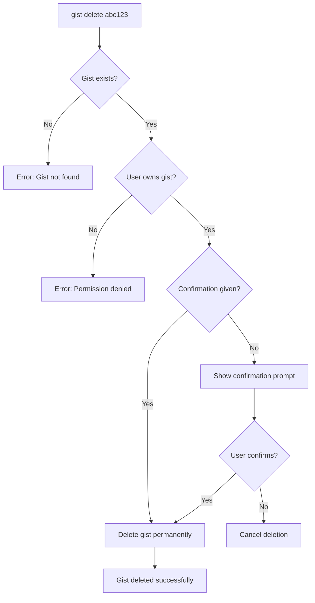
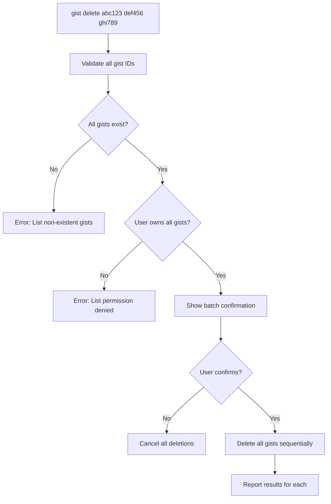
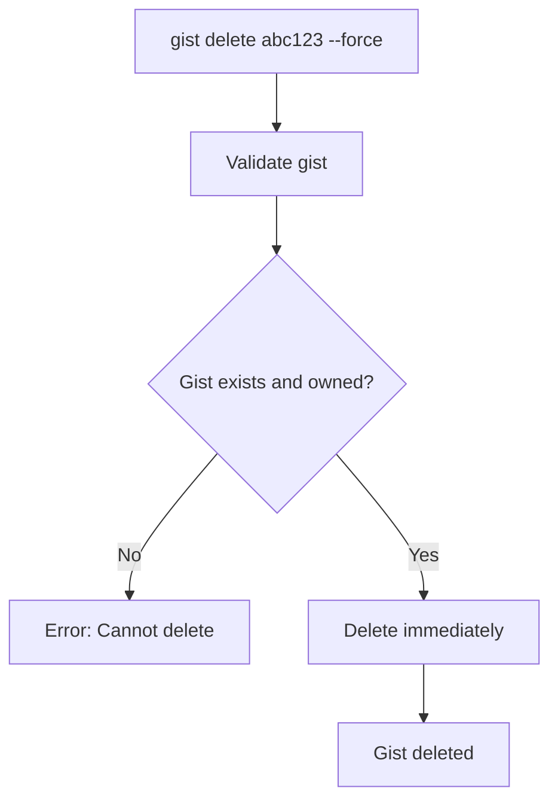
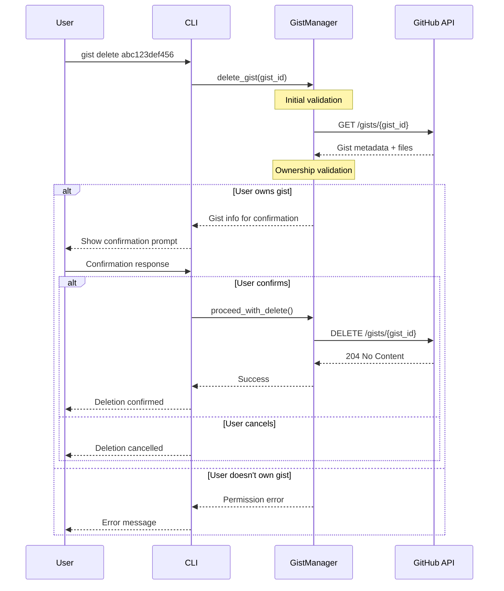
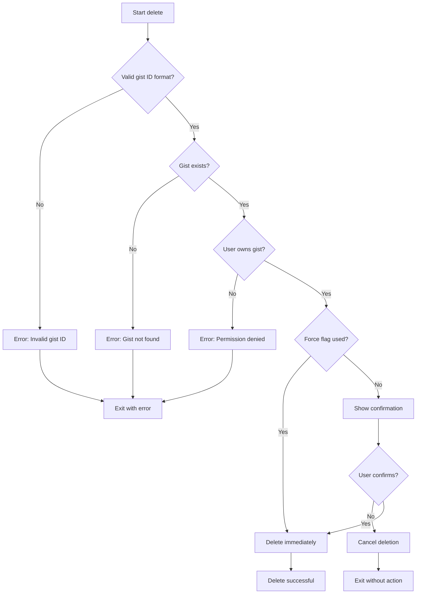
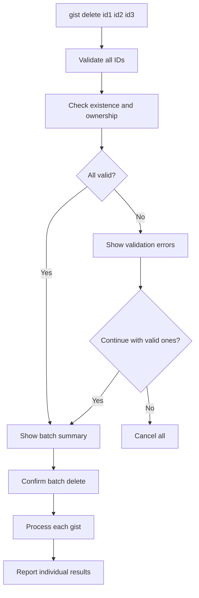
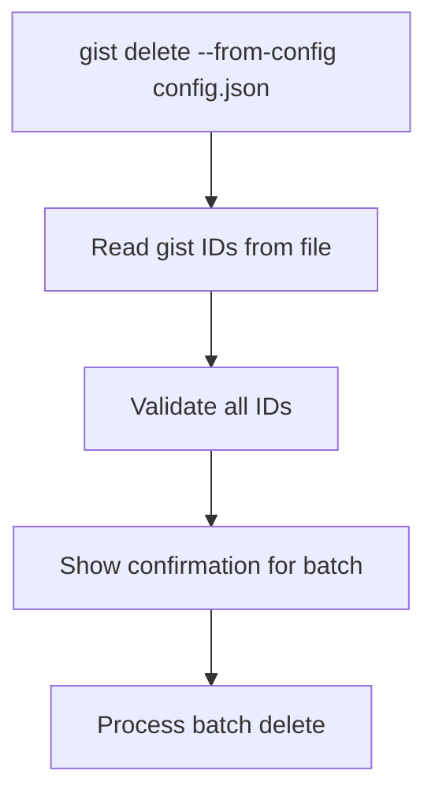
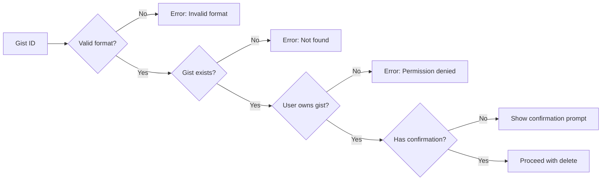

# Gist Delete Flows - Discovery Document

This document defines the delete flows for gists for the implemented `gist delete` functionality in Gistly.

## Table of Contents

- [Executive Summary](#executive-summary)
- [GitHub Gists API](#github-gists-api)
- [Delete Scenarios](#delete-scenarios)
- [Detailed Flows](#detailed-flows)
- [Batch Delete Flows](#batch-delete-flows)
- [Edge Cases and Validations](#edge-cases-and-validations)
- [Implementation Proposal](#implementation-proposal)

## Executive Summary

The `gist delete` functionality will allow permanently removing gists from GitHub. Unlike file operations within a gist, deleting a gist is irreversible - all files, history, and metadata are permanently lost.

### Proposed Command

```bash
gist delete GIST_ID [OPTIONS]
gist delete GIST_ID1 GIST_ID2 GIST_ID3 [OPTIONS]  # Multiple gists
```

## GitHub Gists API

### Delete Endpoint

```
DELETE /gists/{gist_id}
Authorization: token {github_token}
```

### API Behavior

1. **Successful deletion**: Returns HTTP 204 (No Content)
2. **Gist not found**: Returns HTTP 404
3. **Permission denied**: Returns HTTP 403 (if gist belongs to another user)
4. **Invalid token**: Returns HTTP 401
5. **Permanent action**: Cannot be undone - all history is lost

## Delete Scenarios

### Scenario 1: Delete Single Gist



**Example:**
```bash
# Delete a single gist with confirmation
gist delete abc123def456

# Output:
# ⚠️  WARNING: This will permanently delete the gist!
# 
# Gist: "My Python Project" (abc123def456)
# Files: main.py, README.md, utils.py (3 files)
# Created: 2024-01-15 (2 months ago)
# 
# This action CANNOT be undone. All files and history will be lost.
# Type 'DELETE' to confirm: DELETE
# 
# ✅ Gist deleted successfully!
```

### Scenario 2: Delete Multiple Gists



**Example:**
```bash
# Delete multiple gists
gist delete abc123def456 xyz789abc012 mno345pqr678

# Output:
# ⚠️  WARNING: This will permanently delete 3 gists!
# 
# Gists to delete:
# 1. "My Python Project" (abc123def456) - 3 files
# 2. "Quick Script" (xyz789abc012) - 1 file  
# 3. "Config Files" (mno345pqr678) - 2 files
# 
# This action CANNOT be undone. All files and history will be lost.
# Type 'DELETE ALL' to confirm: DELETE ALL
# 
# Deleting gists...
# ✅ abc123def456: Deleted successfully
# ✅ xyz789abc012: Deleted successfully  
# ✅ mno345pqr678: Deleted successfully
# 
# 3 gists deleted successfully!
```

### Scenario 3: Force Delete (Skip Confirmation)



**Example:**
```bash
# Skip confirmation with --force
gist delete abc123def456 --force

# Output:
# ✅ Gist abc123def456 deleted successfully!
```

## Detailed Flows

### Main Delete Flow



### Validation Flow



## Batch Delete Flows

### Scenario 4: Batch Delete with Mixed Results



**Example with mixed results:**
```bash
# Some gists don't exist or permission denied
gist delete abc123 invalid999 def456 notmine789

# Output:
# Validating gists...
# ✅ abc123def456: Valid (My Python Project)
# ❌ invalid999: Gist not found
# ✅ def456ghi789: Valid (Quick Script)  
# ❌ notmine789: Permission denied (owned by other-user)
# 
# 2 valid gists found, 2 errors.
# Continue with deleting the 2 valid gists? [y/N]: y
# 
# ⚠️  WARNING: This will permanently delete 2 gists!
# 
# Gists to delete:
# 1. "My Python Project" (abc123def456)
# 2. "Quick Script" (def456ghi789)
# 
# Type 'DELETE' to confirm: DELETE
# 
# ✅ abc123def456: Deleted successfully
# ✅ def456ghi789: Deleted successfully
# 
# 2 gists deleted successfully, 2 skipped due to errors.
```

### Directory-Based Gist Discovery (Advanced)



**Example:**
```bash
# Delete gists listed in a config file
cat gists-to-delete.txt
# abc123def456
# xyz789abc012
# mno345pqr678

gist delete --from-file gists-to-delete.txt

# Same behavior as manual batch delete
```

## Edge Cases and Validations

### Special Cases

#### 1. Gist with Forks/Stars
```bash
# Popular gist with forks
gist delete abc123def456

# Behavior:
# - Show additional warning about forks/stars
# - Include fork count in confirmation
# - Proceed with normal deletion (forks remain independent)
```

#### 2. Recently Created Gist
```bash
# Gist created less than 1 hour ago
gist delete abc123def456

# Behavior:
# - Show additional warning about recent creation
# - Suggest using update instead if appropriate
# - Allow deletion with explicit confirmation
```

#### 3. Gist with Long History
```bash
# Gist with many revisions
gist delete abc123def456

# Behavior:
# - Show revision count in confirmation
# - Emphasize that all history will be lost
# - Allow deletion with explicit confirmation
```

#### 4. Invalid or Malformed Gist IDs
```bash
# Various invalid formats
gist delete invalid-id
gist delete ""
gist delete "not-a-gist-id"

# Behavior:
# - Validate format before API call
# - Error: "Invalid gist ID format: 'invalid-id'"
# - Error: "Gist ID cannot be empty"
```

### Required Validations



### Safety Checks

1. **Gist ID Format Validation**: Check for valid GitHub gist ID format
2. **Existence Check**: Verify gist exists before attempting delete
3. **Ownership Verification**: Ensure user owns the gist
4. **Confirmation Requirement**: Require explicit confirmation unless --force used
5. **Batch Validation**: Validate all gists before showing confirmation for batch operations

## Implementation Proposal

### 1. CLI Command Structure

```python
@main.command()
@click.argument('gist_ids', nargs=-1, required=True)
@click.option('--force', is_flag=True, 
              help='Skip confirmation prompts and delete immediately')
@click.option('--from-file', type=click.Path(exists=True), 
              help='Read gist IDs from file (one per line)')
@click.option('--dry-run', is_flag=True, 
              help='Show what would be deleted without actually deleting')
@click.option('--quiet', '-q', is_flag=True, 
              help='Minimal output, only show errors')
@click.option('--output', type=click.Choice(['text', 'json']), default='text',
              help='Output format')
def delete(gist_ids, force, from_file, dry_run, quiet, output):
    """Delete one or more gists permanently
    
    GIST_IDS: One or more gist IDs or URLs to delete
    
    ⚠️  WARNING: This action is irreversible!
    All files, history, and metadata will be permanently lost.
    
    Examples:
    
        # Delete single gist
        gist delete abc123def456
        
        # Delete multiple gists
        gist delete abc123def456 xyz789abc012 mno345pqr678
        
        # Force delete without confirmation
        gist delete abc123def456 --force
        
        # Delete gists listed in file
        gist delete --from-file gists-to-delete.txt
        
        # Preview what would be deleted
        gist delete abc123def456 xyz789abc012 --dry-run
        
        # Quiet mode (minimal output)
        gist delete abc123def456 --quiet --force
        
        # JSON output for scripting
        gist delete abc123def456 --force --output json
    """
```

### 2. Core Method in GistManager

```python
def delete_gist(self, gist_id: str) -> Dict:
    """
    Delete a gist permanently
    
    Args:
        gist_id: GitHub gist ID or URL
        
    Returns:
        Dict: Operation result with success status and metadata
        
    Raises:
        GistNotFoundError: If gist doesn't exist
        PermissionDeniedError: If user doesn't own the gist
        APIError: If deletion fails for other reasons
    """

def delete_gists_batch(self, gist_ids: List[str]) -> Dict:
    """
    Delete multiple gists in batch
    
    Args:
        gist_ids: List of gist IDs or URLs
        
    Returns:
        Dict: Batch operation results with individual gist statuses
    """

def get_gist_info(self, gist_id: str) -> Dict:
    """
    Get gist information for confirmation display
    
    Args:
        gist_id: GitHub gist ID
        
    Returns:
        Dict: Gist metadata (title, files, creation date, etc.)
    """
```

### 3. Processing Logic

```python
def _validate_gist_for_deletion(self, gist_id: str) -> Dict:
    """
    Validate gist exists and user has permission to delete
    
    Returns:
        Dict: Validation result with gist info or error details
    """

def _extract_gist_id(self, gist_id_or_url: str) -> str:
    """
    Extract gist ID from URL or return ID if already in correct format
    
    Supports:
    - Raw gist ID: abc123def456
    - Gist URL: https://gist.github.com/user/abc123def456
    - Raw URL: https://gist.github.com/abc123def456
    """

def _confirm_deletion(self, gist_info: Dict, force: bool = False) -> bool:
    """
    Show confirmation prompt for deletion
    
    Returns:
        bool: True if user confirms deletion
    """

def _confirm_batch_deletion(self, gists_info: List[Dict], force: bool = False) -> bool:
    """
    Show confirmation prompt for batch deletion
    
    Returns:
        bool: True if user confirms batch deletion
    """
```

### 4. Extended Use Cases

```bash
# Basic cases
gist delete abc123def456                              # Delete with confirmation
gist delete abc123def456 --force                     # Delete without confirmation
gist delete abc123def456 --dry-run                   # Preview only

# Multiple gists
gist delete abc123 def456 ghi789                     # Delete multiple with confirmation  
gist delete abc123 def456 ghi789 --force             # Delete multiple without confirmation

# From file
gist delete --from-file gists.txt                    # Read IDs from file
gist delete --from-file gists.txt --force            # Batch delete from file

# With URLs
gist delete https://gist.github.com/user/abc123def456 # URL instead of ID

# Output formats
gist delete abc123 --force --output json             # JSON output
gist delete abc123 --quiet --force                   # Minimal output

# Error handling
gist delete nonexistent123                           # Handle not found
gist delete someone-elses-gist                       # Handle permission denied
```

### 5. Expected Output

#### Single Gist Delete
```bash
$ gist delete abc123def456

⚠️  WARNING: This will permanently delete the gist!

Gist: "My Python Project" (abc123def456)
Owner: your-username
Files: main.py, README.md, utils.py (3 files)
Created: 2024-01-15 (2 months ago)
Last updated: 2024-03-10 (1 week ago)
Revisions: 8

This action CANNOT be undone. All files and history will be lost.
Type 'DELETE' to confirm: DELETE

🗑️  Deleting gist...
✅ Gist abc123def456 deleted successfully!
```

#### Batch Delete
```bash
$ gist delete abc123def456 xyz789abc012

⚠️  WARNING: This will permanently delete 2 gists!

Gists to delete:
1. "My Python Project" (abc123def456)
   - Files: main.py, README.md, utils.py (3 files)
   - Created: 2024-01-15 (2 months ago)

2. "Quick Script" (xyz789abc012)  
   - Files: script.py (1 file)
   - Created: 2024-03-05 (2 weeks ago)

This action CANNOT be undone. All files and history will be lost.
Type 'DELETE ALL' to confirm: DELETE ALL

🗑️  Deleting gists...
✅ abc123def456: Deleted successfully
✅ xyz789abc012: Deleted successfully

2 gists deleted successfully!
```

#### Dry Run
```bash
$ gist delete abc123def456 xyz789abc012 --dry-run

🔍 DRY RUN: No actual changes will be made

Gists that would be deleted:
✅ abc123def456: "My Python Project" (3 files)
✅ xyz789abc012: "Quick Script" (1 file)

2 gists would be deleted.

To actually delete these gists, run:
  gist delete abc123def456 xyz789abc012
```

#### JSON Output
```bash
$ gist delete abc123def456 --force --output json

{
  "operation": "delete",
  "success": true,
  "deleted_gists": [
    {
      "id": "abc123def456",
      "description": "My Python Project",
      "files_count": 3,
      "status": "deleted"
    }
  ],
  "errors": [],
  "summary": {
    "total": 1,
    "deleted": 1,
    "failed": 0
  }
}
```

## Benefits of This Implementation

1. **Safety First**: Multiple confirmation layers prevent accidental deletions
2. **Batch Operations**: Efficient handling of multiple gist deletions
3. **Clear Feedback**: Detailed information about what will be deleted
4. **Flexible Input**: Support for both gist IDs and URLs
5. **Error Handling**: Graceful handling of common error scenarios
6. **Automation Friendly**: Force and quiet modes for scripts
7. **Dry Run Support**: Preview functionality for safety

## Next Steps

1. Implement `get_gist_info()` for confirmation display
2. Implement `delete_gist()` with proper error handling
3. Implement `delete_gists_batch()` for multiple deletions
4. Add `delete` CLI command with all options
5. Create comprehensive tests for all scenarios (success, failures, edge cases)
6. Add safety validations and confirmation prompts
7. Document usage examples and safety considerations

---

*✅ The described flows have been successfully implemented and validated with comprehensive test coverage.*