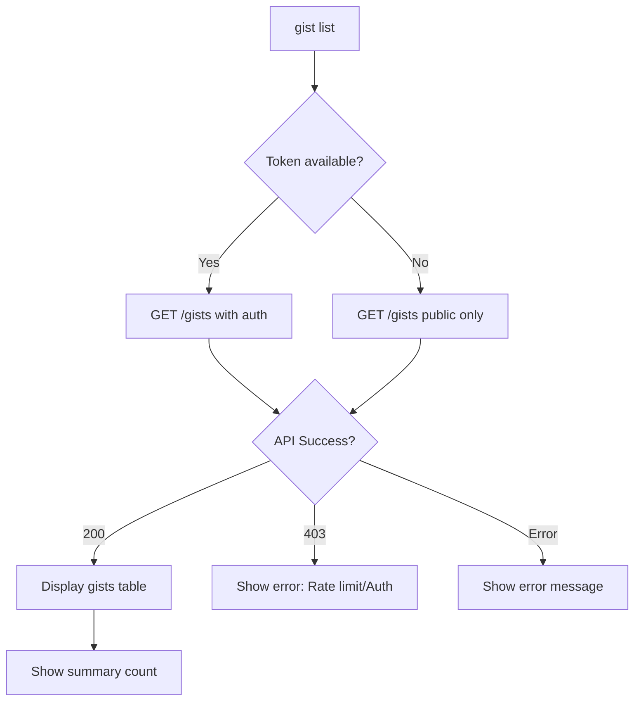
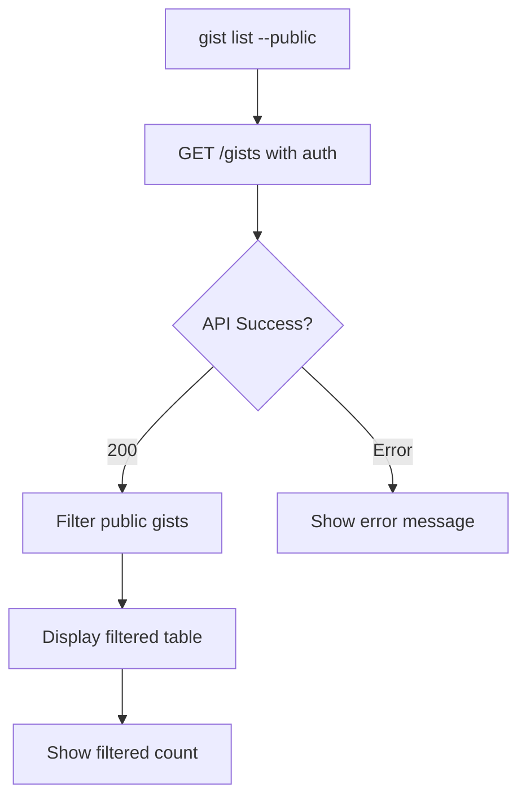
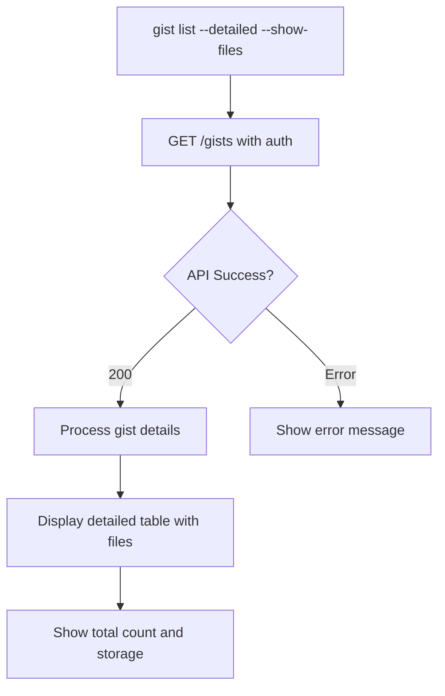
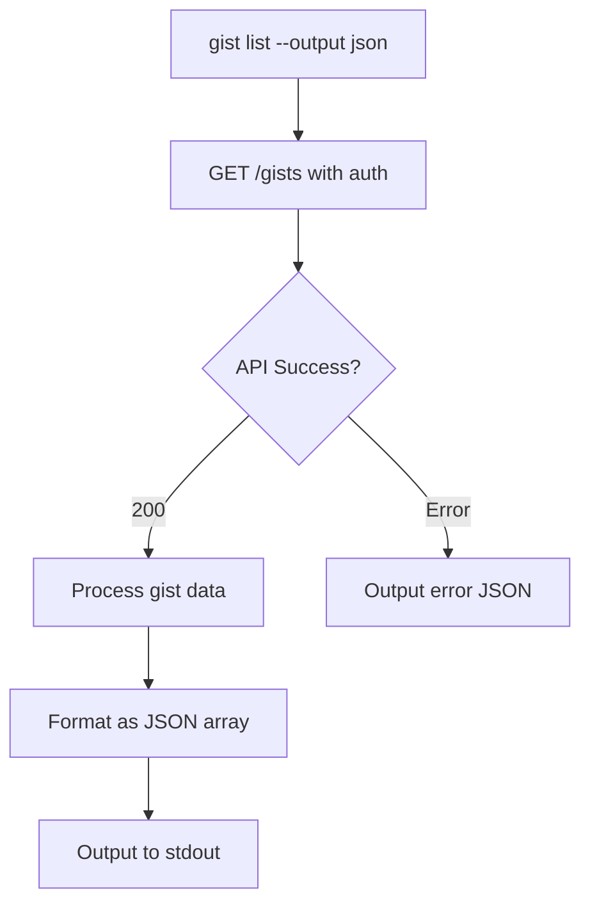
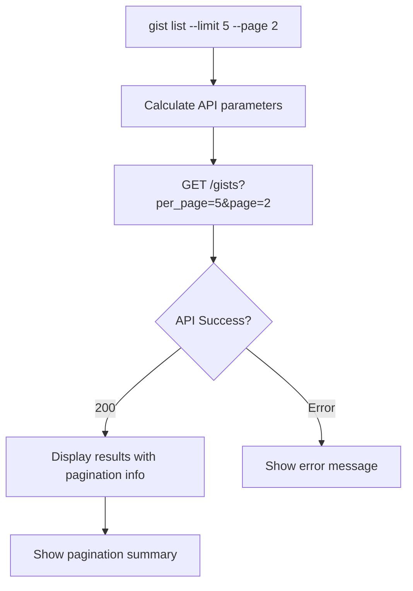
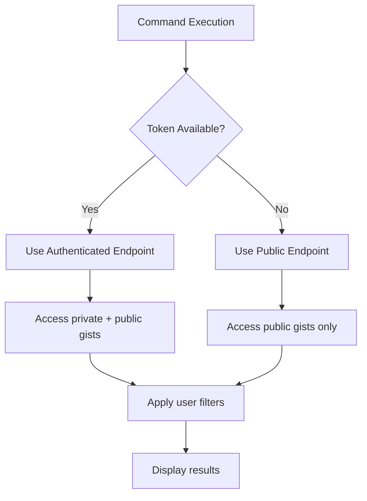
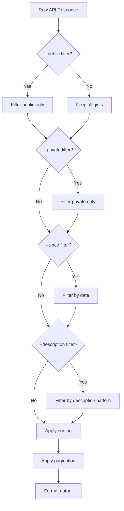
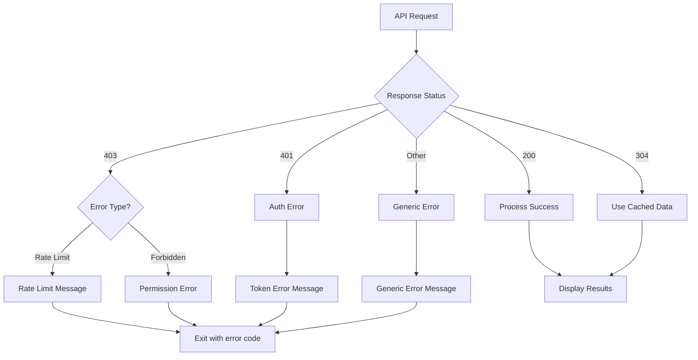

# Gist List Flows - Discovery Document

**Status**: ✅ IMPLEMENTED  
**Implementation Date**: 2025-09-16  

This document defines the list flows for gists for the `gist list` functionality in Gistly.

## Table of Contents

- [Executive Summary](#executive-summary)
- [GitHub Gists API](#github-gists-api)
- [List Scenarios](#list-scenarios)
- [Detailed Flows](#detailed-flows)
- [Filtering and Pagination](#filtering-and-pagination)
- [Output Formats](#output-formats)
- [Edge Cases and Validations](#edge-cases-and-validations)
- [Implementation Proposal](#implementation-proposal)

## Executive Summary

The `gist list` functionality will allow users to view and filter their existing gists with various display and filtering options. This completes the CRUD operations for gist management in Gistly.

### Proposed Commands

```bash
# List all authenticated user's gists
gist list

# List with specific filters
gist list --public --limit 10 --since "2024-01-01"

# List with different output formats
gist list --output json --quiet

# List with detailed information
gist list --detailed --show-files
```

### Key Features
- List authenticated user's gists or public gists
- Filter by visibility (public/private), date, and description
- Support pagination and limiting results
- Multiple output formats (table, json, minimal)
- Show file information and metadata

## GitHub Gists API

### List Gists Endpoint

```
GET /gists
Authorization: token {github_token}
Accept: application/vnd.github+json
X-GitHub-Api-Version: 2022-11-28

Query Parameters:
- since: string (ISO 8601 timestamp)
- per_page: integer (1-100, default 30)
- page: integer (default 1)
```

### Response Format

```json
[
  {
    "id": "aa5a315d61ae9438b18d",
    "node_id": "MDQ6R2lzdGFhNWEzMTVkNjFhZTk0MzhiMThk",
    "url": "https://api.github.com/gists/aa5a315d61ae9438b18d",
    "forks_url": "https://api.github.com/gists/aa5a315d61ae9438b18d/forks",
    "commits_url": "https://api.github.com/gists/aa5a315d61ae9438b18d/commits",
    "git_pull_url": "https://gist.github.com/aa5a315d61ae9438b18d.git",
    "git_push_url": "https://gist.github.com/aa5a315d61ae9438b18d.git",
    "html_url": "https://gist.github.com/aa5a315d61ae9438b18d",
    "files": {
      "hello_world.rb": {
        "filename": "hello_world.rb",
        "type": "application/x-ruby",
        "language": "Ruby",
        "raw_url": "https://gist.githubusercontent.com/octocat/6cad326836d38bd3a7ae/raw/db9c55113504e46fa076e7df3a04ce592e2e86d8/hello_world.rb",
        "size": 167
      }
    },
    "public": true,
    "created_at": "2010-04-14T02:15:15Z",
    "updated_at": "2011-01-26T19:06:43Z",
    "description": "Hello World Examples",
    "comments": 0,
    "user": null,
    "comments_url": "https://api.github.com/gists/aa5a315d61ae9438b18d/comments",
    "owner": {
      "login": "octocat",
      "id": 1,
      "node_id": "MDQ6VXNlcjE=",
      "avatar_url": "https://github.com/images/error/octocat_happy.gif",
      "gravatar_id": "",
      "url": "https://api.github.com/users/octocat",
      "html_url": "https://github.com/octocat",
      "type": "User",
      "site_admin": false
    },
    "truncated": false
  }
]
```

### Status Codes
- **200**: Success
- **304**: Not Modified (when using conditional requests)
- **403**: Forbidden (rate limit exceeded or insufficient permissions)

## List Scenarios

### Scenario 1: Basic List - Show All User Gists



**Example:**
```bash
$ gist list
┌──────────────────┬─────────────┬─────────┬─────────┬──────────────────────┐
│ ID               │ Description │ Public  │ Files   │ Updated              │
├──────────────────┼─────────────┼─────────┼─────────┼──────────────────────┤
│ aa5a315d61ae9438 │ Hello World │ ✓       │ 1       │ 2024-09-15 10:30:15  │
│ bb6b426e72bf0549 │ Python Utils│ ✗       │ 3       │ 2024-09-14 15:22:33  │
│ cc7c537f83c06660 │ Config Files│ ✗       │ 2       │ 2024-09-13 09:45:12  │
└──────────────────┴─────────────┴─────────┴─────────┴──────────────────────┘

Total: 3 gists
```

### Scenario 2: Filtered List - Public Gists Only



**Example:**
```bash
$ gist list --public
┌──────────────────┬─────────────┬─────────┬──────────────────────┐
│ ID               │ Description │ Files   │ Updated              │
├──────────────────┼─────────────┼─────────┼──────────────────────┤
│ aa5a315d61ae9438 │ Hello World │ 1       │ 2024-09-15 10:30:15  │
└──────────────────┴─────────────┴─────────┴──────────────────────┘

Total: 1 public gist (of 3 total)
```

### Scenario 3: Detailed List with File Information



**Example:**
```bash
$ gist list --detailed --show-files
┌──────────────────┬─────────────┬─────────┬─────────┬──────────────────────┬────────────┐
│ ID               │ Description │ Public  │ Files   │ Updated              │ Total Size │
├──────────────────┼─────────────┼─────────┼─────────┼──────────────────────┼────────────┤
│ aa5a315d61ae9438 │ Hello World │ ✓       │ 1       │ 2024-09-15 10:30:15  │ 167 bytes  │
│   └── hello_world.rb (Ruby, 167 bytes)                                              │
│ bb6b426e72bf0549 │ Python Utils│ ✗       │ 3       │ 2024-09-14 15:22:33  │ 2.1 KB     │
│   ├── utils.py (Python, 1.2 KB)                                                     │
│   ├── config.json (JSON, 567 bytes)                                                 │
│   └── README.md (Markdown, 389 bytes)                                               │
└──────────────────┴─────────────┴─────────┴─────────┴──────────────────────┴────────────┘

Total: 3 gists, 6 files, 2.3 KB
```

### Scenario 4: JSON Output for Scripting



**Example:**
```bash
$ gist list --output json --public
[
  {
    "id": "aa5a315d61ae9438b18d",
    "description": "Hello World Examples",
    "public": true,
    "files": [
      {
        "filename": "hello_world.rb",
        "language": "Ruby",
        "size": 167
      }
    ],
    "created_at": "2010-04-14T02:15:15Z",
    "updated_at": "2011-01-26T19:06:43Z",
    "html_url": "https://gist.github.com/aa5a315d61ae9438b18d",
    "file_count": 1,
    "total_size": 167
  }
]
```

### Scenario 5: Paginated Results with Limits



**Example:**
```bash
$ gist list --limit 5 --page 2
┌──────────────────┬─────────────┬─────────┬─────────┬──────────────────────┐
│ ID               │ Description │ Public  │ Files   │ Updated              │
├──────────────────┼─────────────┼─────────┼─────────┼──────────────────────┤
│ dd8d648g94d17771 │ Scripts     │ ✗       │ 4       │ 2024-09-10 08:15:42  │
│ ee9e759h05e28882 │ Configs     │ ✓       │ 2       │ 2024-09-09 14:30:18  │
│ ff0f860i16f39993 │ Templates   │ ✗       │ 1       │ 2024-09-08 11:45:55  │
└──────────────────┴─────────────┴─────────┴─────────┴──────────────────────┘

Page 2 of 4 (showing 3 of 18 total gists)
```

## Detailed Flows

### Authentication Flow



### Filter Processing Flow



### Error Handling Flow



## Filtering and Pagination

### Supported Filters

1. **Visibility Filters**
   - `--public`: Show only public gists
   - `--private`: Show only private gists
   - Default: Show both

2. **Date Filters**
   - `--since DATE`: Show gists updated after date
   - `--before DATE`: Show gists updated before date
   - Date formats: ISO 8601, YYYY-MM-DD, relative (e.g., "7 days ago")

3. **Content Filters**
   - `--description PATTERN`: Filter by description pattern (regex support)
   - `--filename PATTERN`: Filter by filename pattern
   - `--language LANG`: Filter by file language

4. **Metadata Filters**
   - `--has-files N`: Gists with specific file count
   - `--min-files N`: Gists with minimum file count
   - `--max-files N`: Gists with maximum file count

### Pagination Options

1. **Limit Controls**
   - `--limit N`: Maximum number of results (default: 30, max: 100)
   - `--page N`: Page number (default: 1)
   - `--all`: Fetch all results (ignores pagination)

2. **Sorting Options**
   - `--sort-by FIELD`: Sort by created, updated, files, size
   - `--order ORDER`: asc or desc (default: desc for dates)

### Example Complex Filter

```bash
gist list --public --since "2024-01-01" --description "python" --min-files 2 --sort-by updated --limit 10
```

## Output Formats

### 1. Table Format (Default)

```
┌──────────────────┬─────────────┬─────────┬─────────┬──────────────────────┐
│ ID               │ Description │ Public  │ Files   │ Updated              │
├──────────────────┼─────────────┼─────────┼─────────┼──────────────────────┤
│ aa5a315d61ae9438 │ Hello World │ ✓       │ 1       │ 2024-09-15 10:30:15  │
└──────────────────┴─────────────┴─────────┴─────────┴──────────────────────┘
```

### 2. Minimal Format

```bash
$ gist list --output minimal
aa5a315d61ae9438  Hello World Examples
bb6b426e72bf0549  Python utilities and helpers
cc7c537f83c06660  Configuration files
```

### 3. JSON Format

```json
[
  {
    "id": "aa5a315d61ae9438b18d",
    "description": "Hello World Examples",
    "public": true,
    "file_count": 1,
    "total_size": 167,
    "created_at": "2010-04-14T02:15:15Z",
    "updated_at": "2011-01-26T19:06:43Z",
    "html_url": "https://gist.github.com/aa5a315d61ae9438b18d"
  }
]
```

### 4. Detailed Format

Includes file information, sizes, languages, and metadata.

### 5. CSV Format

For data export and analysis:

```csv
id,description,public,files,created_at,updated_at,html_url
aa5a315d61ae9438b18d,"Hello World Examples",true,1,2010-04-14T02:15:15Z,2011-01-26T19:06:43Z,https://gist.github.com/aa5a315d61ae9438b18d
```

## Edge Cases and Validations

### Authentication Edge Cases

1. **No Token Available**
   ```
   Warning: No GitHub token found. Showing public gists only.
   To see your private gists, set GITHUB_TOKEN or configure authentication.
   ```

2. **Invalid Token**
   ```
   Error: Authentication failed. Please check your GitHub token.
   Current token: ghp_****...****1234
   ```

3. **Insufficient Permissions**
   ```
   Error: Token does not have gist permissions.
   Required scopes: gist
   ```

### Rate Limiting

1. **Rate Limit Exceeded**
   ```
   Error: GitHub API rate limit exceeded.
   Limit: 5000 requests/hour
   Remaining: 0
   Reset: 2024-09-16 15:30:00 UTC (in 45 minutes)
   ```

2. **Rate Limit Warning**
   ```
   Warning: API rate limit low (50 requests remaining).
   Consider using --limit to reduce API calls.
   ```

### Data Validation

1. **Empty Results**
   ```bash
   $ gist list --private --since "2025-01-01"
   No gists found matching the specified criteria.
   
   Filters applied:
   - Visibility: private only
   - Since: 2025-01-01
   
   Try removing some filters to see more results.
   ```

2. **Invalid Date Format**
   ```
   Error: Invalid date format '2024-13-45'.
   Supported formats:
   - ISO 8601: 2024-09-16T10:30:00Z
   - Date only: 2024-09-16
   - Relative: "7 days ago", "1 week ago"
   ```

3. **Invalid Pagination**
   ```
   Error: Page number must be positive (got: -1)
   Error: Limit must be between 1 and 100 (got: 150)
   ```

### Network Issues

1. **Connection Timeout**
   ```
   Error: Connection timeout while fetching gists.
   Please check your internet connection and try again.
   ```

2. **GitHub API Unavailable**
   ```
   Error: GitHub API is currently unavailable.
   Status: 503 Service Unavailable
   Please try again later.
   ```

### Large Dataset Handling

1. **Many Gists Warning**
   ```
   Warning: You have 500+ gists. Consider using filters to narrow results.
   Use --limit or --page for pagination, or --all to fetch everything.
   ```

2. **Memory Usage**
   - Implement streaming for `--all` with large datasets
   - Warn when fetching >1000 gists without pagination

## Implementation Proposal

### Core Architecture

#### 1. GistManager Methods

```python
class GistManager:
    def list_gists(
        self, 
        visibility: Optional[str] = None,  # 'public', 'private', None
        since: Optional[str] = None,
        limit: Optional[int] = None,
        page: int = 1,
        fetch_all: bool = False
    ) -> Dict:
        """
        List gists with filtering and pagination.
        
        Returns:
        {
            'gists': [list of gist objects],
            'total_count': int,
            'page': int,
            'per_page': int,
            'has_more': bool
        }
        """
    
    def _fetch_gists_page(self, page: int, per_page: int, since: Optional[str] = None) -> List[Dict]:
        """Fetch a single page of gists from GitHub API."""
    
    def _process_gist_data(self, raw_gist: Dict) -> Dict:
        """Process raw API response into standardized format."""
    
    def _apply_filters(self, gists: List[Dict], filters: Dict) -> List[Dict]:
        """Apply client-side filters to gist list."""
```

#### 2. CLI Implementation

```python
@main.command()
@click.option('--public', 'visibility', flag_value='public', help='Show only public gists')
@click.option('--private', 'visibility', flag_value='private', help='Show only private gists')
@click.option('--since', help='Show gists updated after date (ISO 8601 or YYYY-MM-DD)')
@click.option('--before', help='Show gists updated before date')
@click.option('--description', help='Filter by description pattern (regex)')
@click.option('--filename', help='Filter by filename pattern')
@click.option('--language', help='Filter by file language')
@click.option('--min-files', type=int, help='Minimum number of files')
@click.option('--max-files', type=int, help='Maximum number of files')
@click.option('--limit', type=int, default=30, help='Maximum results per page (1-100)')
@click.option('--page', type=int, default=1, help='Page number')
@click.option('--all', 'fetch_all', is_flag=True, help='Fetch all results (ignores pagination)')
@click.option('--sort-by', type=click.Choice(['created', 'updated', 'files', 'size']), 
              default='updated', help='Sort field')
@click.option('--order', type=click.Choice(['asc', 'desc']), default='desc', help='Sort order')
@click.option('--output', '-o', type=click.Choice(['table', 'json', 'minimal', 'detailed', 'csv']), 
              default='table', help='Output format')
@click.option('--show-files', is_flag=True, help='Show file details in output')
@click.option('--quiet', '-q', is_flag=True, help='Minimal output')
def list(visibility, since, before, description, filename, language, min_files, max_files,
         limit, page, fetch_all, sort_by, order, output, show_files, quiet):
    """List your gists with filtering and pagination options."""
```

#### 3. Output Formatters

```python
class OutputFormatter:
    @staticmethod
    def format_table(gists: List[Dict], show_files: bool = False) -> str:
        """Format gists as a table using tabulate or similar."""
    
    @staticmethod
    def format_json(gists: List[Dict]) -> str:
        """Format gists as JSON array."""
    
    @staticmethod
    def format_minimal(gists: List[Dict]) -> str:
        """Format gists as simple ID + description lines."""
    
    @staticmethod
    def format_detailed(gists: List[Dict]) -> str:
        """Format gists with full details and file information."""
    
    @staticmethod
    def format_csv(gists: List[Dict]) -> str:
        """Format gists as CSV for data export."""
```

#### 4. Filter Engine

```python
class GistFilter:
    def __init__(self, filters: Dict):
        self.filters = filters
    
    def apply(self, gists: List[Dict]) -> List[Dict]:
        """Apply all filters to gist list."""
        
    def _filter_by_visibility(self, gists: List[Dict]) -> List[Dict]:
        """Filter by public/private visibility."""
    
    def _filter_by_date_range(self, gists: List[Dict]) -> List[Dict]:
        """Filter by date range (since/before)."""
    
    def _filter_by_description(self, gists: List[Dict]) -> List[Dict]:
        """Filter by description pattern matching."""
    
    def _filter_by_files(self, gists: List[Dict]) -> List[Dict]:
        """Filter by file count, names, or languages."""
    
    def _sort_gists(self, gists: List[Dict]) -> List[Dict]:
        """Sort gists by specified field and order."""
```

### Testing Strategy

#### 1. Unit Tests (15 tests)

```python
class TestGistManagerList:
    def test_list_gists_success(self)
    def test_list_gists_with_pagination(self)
    def test_list_gists_fetch_all(self)
    def test_list_gists_with_since_filter(self)
    def test_list_gists_authentication_error(self)
    def test_list_gists_rate_limit_error(self)
    def test_list_gists_network_error(self)
    def test_process_gist_data(self)
    def test_apply_filters_visibility(self)
    def test_apply_filters_date_range(self)
    def test_apply_filters_description(self)
    def test_apply_filters_file_count(self)
    def test_fetch_gists_page(self)
    def test_empty_results(self)
    def test_malformed_api_response(self)
```

#### 2. CLI Tests (20 tests)

```python
class TestListCommand:
    def test_list_command_basic(self)
    def test_list_command_public_only(self)
    def test_list_command_private_only(self)
    def test_list_command_with_pagination(self)
    def test_list_command_fetch_all(self)
    def test_list_command_json_output(self)
    def test_list_command_minimal_output(self)
    def test_list_command_detailed_output(self)
    def test_list_command_csv_output(self)
    def test_list_command_with_filters(self)
    def test_list_command_date_filters(self)
    def test_list_command_sorting(self)
    def test_list_command_show_files(self)
    def test_list_command_quiet_mode(self)
    def test_list_command_no_token(self)
    def test_list_command_invalid_token(self)
    def test_list_command_rate_limit(self)
    def test_list_command_empty_results(self)
    def test_list_command_invalid_options(self)
    def test_list_command_network_error(self)
```

#### 3. Integration Tests (5 tests)

```python
class TestListIntegration:
    def test_end_to_end_list_workflow(self)
    def test_large_dataset_handling(self)
    def test_filter_combinations(self)
    def test_output_format_consistency(self)
    def test_pagination_edge_cases(self)
```

### Dependencies

#### New Dependencies

```python
# requirements.txt additions
tabulate>=0.9.0    # For table formatting
python-dateutil>=2.8.2  # For flexible date parsing

# requirements-dev.txt additions  
freezegun>=1.2.2   # For testing date-related functionality
```

#### Existing Dependencies
- `requests`: HTTP API calls
- `click`: CLI framework
- `pytest`: Testing
- `responses`: API mocking

### File Structure

```
gist_manager/
├── core.py           # Add list_gists methods
├── cli.py            # Add list command
├── filters.py        # New: filtering and sorting logic
├── formatters.py     # New: output formatting
└── utils.py          # Date parsing utilities

tests/
├── test_core.py      # Add list functionality tests
├── test_cli.py       # Add list command tests
├── test_filters.py   # New: filter engine tests
├── test_formatters.py # New: output format tests
└── fixtures/
    └── list_responses.json  # Mock API responses
```

### Performance Considerations

1. **API Efficiency**
   - Use pagination to avoid loading unnecessary data
   - Implement client-side caching for repeated requests
   - Batch API calls when fetching all results

2. **Memory Management**
   - Stream processing for large datasets
   - Lazy loading of detailed information
   - Configurable memory limits

3. **User Experience**
   - Progress indicators for long operations
   - Responsive pagination with reasonable defaults
   - Fast filters that don't require API calls

### Security Considerations

1. **Token Handling**
   - No token logging in output
   - Secure token validation
   - Clear error messages without exposing sensitive data

2. **Input Validation**
   - Sanitize regex patterns
   - Validate date inputs
   - Prevent injection in filter patterns

3. **Rate Limiting**
   - Respect GitHub API limits
   - Implement exponential backoff
   - Clear rate limit communication

---

This discovery document provides comprehensive guidance for implementing the `gist list` functionality following established patterns and ensuring robust, user-friendly operation.