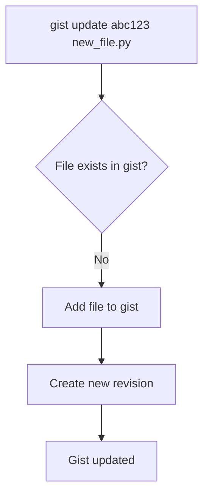
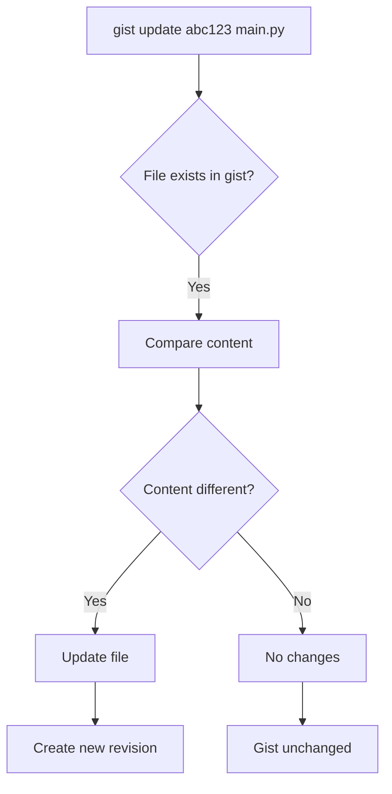
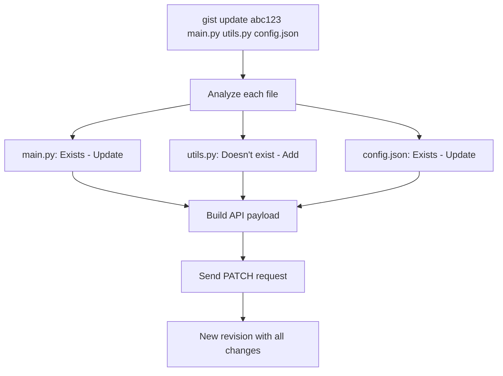
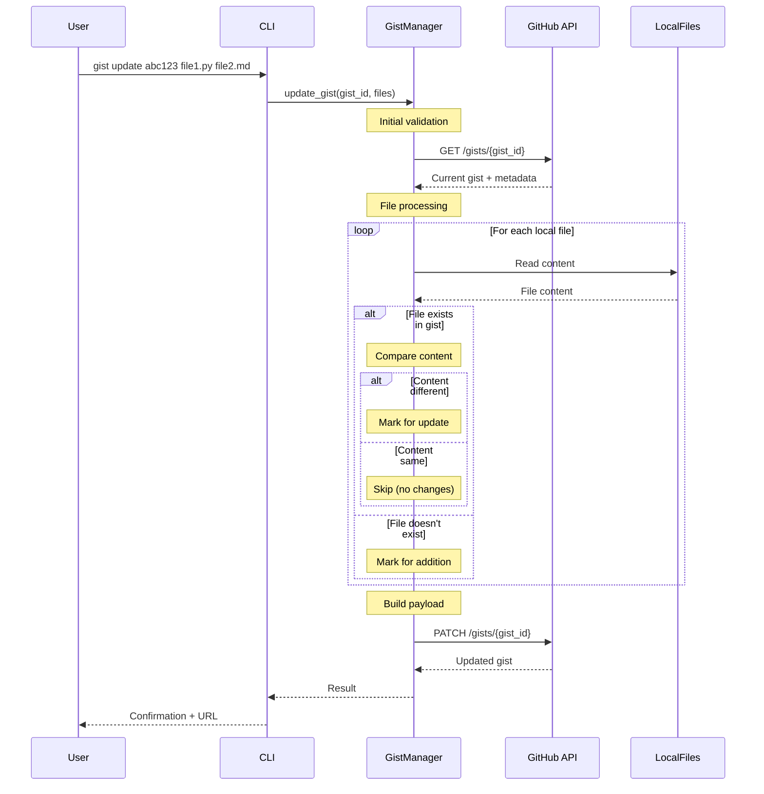
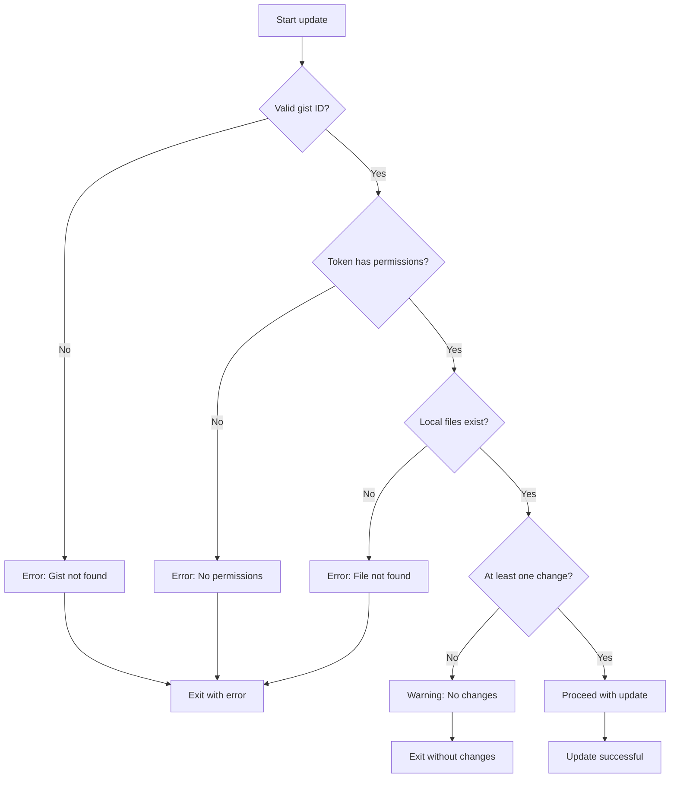
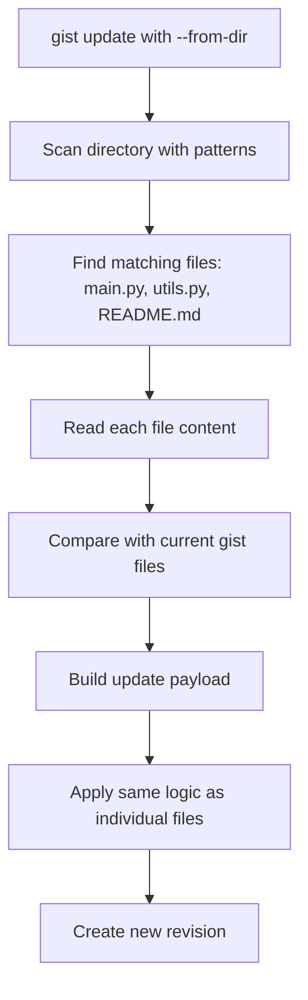
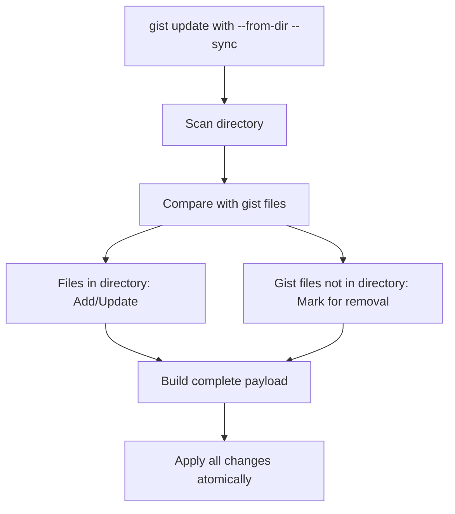
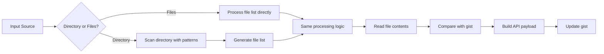
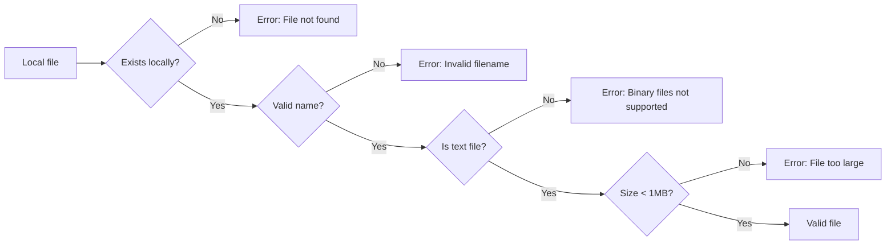

# Gist Update Flows - Discovery Document

This document defines the update flows for gists for the proposed `gist update` functionality in Gistly.

## Table of Contents

- [Executive Summary](#executive-summary)
- [GitHub Gists API](#github-gists-api)
- [Update Scenarios](#update-scenarios)
- [Detailed Flows](#detailed-flows)
- [Directory Update Flows](#directory-update-flows)
- [Edge Cases and Validations](#edge-cases-and-validations)
- [Implementation Proposal](#implementation-proposal)

## Executive Summary

The `gist update` functionality will allow modifying existing gists by adding, updating, or removing files. GitHub Gists automatically handles versioning, creating a new revision in the history each time an update occurs.

### Proposed Command

```bash
gist update GIST_ID [FILES...] [OPTIONS]
gist update GIST_ID --from-dir DIRECTORY --patterns "*.py" "*.md" [OPTIONS]
```

## GitHub Gists API

### Update Endpoint

```
PATCH /gists/{gist_id}
Authorization: token {github_token}
Content-Type: application/json

{
  "description": "New description (optional)",
  "files": {
    "file1.py": {
      "content": "new content"
    },
    "file2.md": {
      "filename": "renamed_file.md",
      "content": "updated content"
    },
    "file_to_delete.txt": null
  }
}
```

### API Behavior

1. **Files not mentioned**: Remain unchanged
2. **New files**: Added to the gist
3. **Existing files**: Updated with new content
4. **Files with `null`**: Removed from the gist
5. **Versioning**: GitHub automatically creates a new revision

## Update Scenarios

### Scenario 1: Add New File



**Example:**
```bash
# Current gist: [main.py, README.md]
gist update abc123def456 utils.py

# Result: [main.py, README.md, utils.py]
# New revision created automatically
```

### Scenario 2: Update Existing File



**Example:**
```bash
# Current gist: [main.py, README.md]
gist update abc123def456 main.py  # main.py modified locally

# Result: [main.py (new version), README.md]
# New revision created
```

### Scenario 3: Multiple Files (Mixed)



**Example:**
```bash
# Current gist: [main.py, README.md]
gist update abc123def456 main.py utils.py helpers.py

# Analysis:
# - main.py: exists → update
# - utils.py: doesn't exist → add
# - helpers.py: doesn't exist → add

# Result: [main.py (updated), README.md, utils.py (new), helpers.py (new)]
```

## Detailed Flows

### Main Update Flow



### Validation Flow



## Directory Update Flows

### Scenario 4: Update from Directory



**Example:**
```bash
# Current gist: [main.py, old_utils.py, README.md]
# Local directory: ./src/ contains [main.py, utils.py, helpers.py, README.md, config.py]

gist update abc123def456 --from-dir ./src --patterns "*.py" "*.md"

# Files found: [main.py, utils.py, helpers.py, README.md, config.py]
# Analysis:
# - main.py: exists in gist → compare content → update if different
# - utils.py: doesn't exist in gist → add as new file
# - helpers.py: doesn't exist in gist → add as new file  
# - README.md: exists in gist → compare content → update if different
# - config.py: doesn't exist in gist → add as new file
# - old_utils.py: exists in gist but not in directory → remains unchanged

# Result: [main.py (maybe updated), old_utils.py, utils.py (new), helpers.py (new), README.md (maybe updated), config.py (new)]
```

### Directory Update with Explicit Remove



**Example with --sync flag:**
```bash
# Current gist: [main.py, old_utils.py, README.md, legacy.py]
# Local directory: ./src/ contains [main.py, utils.py, helpers.py]

gist update abc123def456 --from-dir ./src --patterns "*.py" --sync

# With --sync flag:
# - main.py: exists → update
# - utils.py: new → add
# - helpers.py: new → add
# - old_utils.py: not in directory → remove
# - legacy.py: not in directory → remove
# - README.md: not matching pattern → keep unchanged

# Result: [main.py (updated), utils.py (new), helpers.py (new), README.md]
```

### Directory vs Individual Files Flow Comparison



## Edge Cases and Validations

### Special Cases

#### 1. File with Same Content
```bash
# If local file has same content as in gist
gist update abc123 main.py  # No real changes

# Behavior: 
# - Detect no changes
# - Show warning: "No changes detected for main.py"
# - Don't make API request if no files have changes
```

#### 2. Gist with Files Not Locally Present
```bash
# Current gist: [main.py, README.md, config.json]
gist update abc123 main.py  # Only update main.py

# Behavior:
# - README.md and config.json remain unchanged
# - Only main.py gets updated
# - Other files are not touched
```

#### 3. Directory Update with Mixed Patterns
```bash
# Directory contains: [main.py, test.py, README.md, config.json, image.png]
gist update abc123 --from-dir . --patterns "*.py" "*.md"

# Files processed: [main.py, test.py, README.md]
# Files ignored: [config.json, image.png]
# Behavior: Only files matching patterns are considered
```

#### 4. Files with Problematic Names
```bash
# GitHub doesn't allow files starting with "gistfile"
gist update abc123 gistfile1.txt

# Behavior:
# - Validate name before sending
# - Error: "Invalid filename: 'gistfile1.txt'. Filenames cannot start with 'gistfile'"
```

### Required Validations



## Implementation Proposal

### 1. CLI Command Structure

```python
@main.command()
@click.argument('gist_id', required=True)
@click.argument('files', nargs=-1, type=click.Path(exists=True))
@click.option('--description', '-d', help='Update gist description')
@click.option('--from-dir', type=click.Path(exists=True, file_okay=False), 
              help='Update from directory instead of individual files')
@click.option('--patterns', multiple=True, 
              help='File patterns when using --from-dir (e.g., "*.py" "*.md")')
@click.option('--add', multiple=True, type=click.Path(exists=True), 
              help='Explicitly add new files')
@click.option('--remove', multiple=True, 
              help='Remove files from gist (by filename)')
@click.option('--sync', is_flag=True, 
              help='Sync mode: remove gist files not present in directory')
@click.option('--dry-run', is_flag=True, 
              help='Show what would be changed without making changes')
@click.option('--force', is_flag=True, 
              help='Skip confirmation prompts')
def update(gist_id, files, description, from_dir, patterns, add, remove, sync, dry_run, force):
    """Update an existing gist
    
    GIST_ID: The ID or URL of the gist to update
    FILES: Local files to add or update in the gist
    
    Examples:
    
        # Update individual files
        gist update abc123def456 main.py utils.py
        
        # Update from directory
        gist update abc123def456 --from-dir ./src --patterns "*.py" "*.md"
        
        # Sync directory (remove files not in directory)
        gist update abc123def456 --from-dir ./src --patterns "*.py" --sync
        
        # Explicit operations
        gist update abc123def456 --add new_file.py --remove old_file.py
        
        # Update description only
        gist update abc123def456 --description "Updated version"
        
        # Preview changes
        gist update abc123def456 *.py --dry-run
    """
```

### 2. Core Method in GistManager

```python
def update_gist(self, gist_id: str, files: Dict[str, str] = None, 
                description: str = None, files_to_remove: List[str] = None) -> Dict:
    """
    Update an existing gist
    
    Args:
        gist_id: GitHub gist ID
        files: Dict of filename -> content for files to add/update
        description: New description (optional)
        files_to_remove: List of filenames to remove from gist
        
    Returns:
        Dict: Updated gist information
        
    Raises:
        Exception: If gist not found, permission denied, or update fails
    """

def get_gist(self, gist_id: str) -> Dict:
    """
    Retrieve an existing gist
    
    Args:
        gist_id: GitHub gist ID
        
    Returns:
        Dict: Gist information including files and metadata
    """

def update_from_directory(self, gist_id: str, directory: Union[str, Path], 
                         patterns: List[str], description: str = None,
                         sync: bool = False) -> Dict:
    """
    Update gist from directory files matching patterns
    
    Args:
        gist_id: GitHub gist ID
        directory: Directory to scan
        patterns: File patterns to match
        description: New description (optional)
        sync: If True, remove gist files not present in directory
        
    Returns:
        Dict: Updated gist information
    """
```

### 3. Processing Logic

```python
def _prepare_update_payload(self, current_gist: Dict, 
                          new_files: Dict[str, str],
                          files_to_remove: List[str],
                          description: str = None,
                          sync_mode: bool = False) -> Dict:
    """
    Prepare the payload for PATCH request
    
    Logic:
    1. Start with empty files dict
    2. For each new file:
       - If exists in gist and content different: add to update
       - If not exists in gist: add as new
       - If exists and content same: skip
    3. For each file to remove: set to null
    4. If sync_mode: mark gist files not in new_files for removal
    5. Only include files that have changes
    """
```

### 4. Extended Use Cases

```bash
# Basic cases
gist update abc123 main.py                    # Update one file
gist update abc123 main.py utils.py          # Update multiple files
gist update abc123 --description "New desc"  # Only change description

# Directory cases
gist update abc123 --from-dir ./src --patterns "*.py"           # Add/update Python files
gist update abc123 --from-dir ./docs --patterns "*.md" "*.txt"  # Multiple patterns
gist update abc123 --from-dir ./src --patterns "*.py" --sync    # Sync mode

# Advanced cases
gist update abc123 *.py --dry-run            # Preview changes
gist update abc123 --add new.py --remove old.py  # Explicit operations
gist update abc123 main.py --force          # No confirmation

# With URL instead of ID
gist update https://gist.github.com/user/abc123def456 main.py
```

### 5. Expected Output

```bash
$ gist update abc123def456 --from-dir ./src --patterns "*.py" "*.md"

Analyzing gist abc123def456...
✓ Gist found: "My Python Project" (3 files)

Scanning directory ./src with patterns: *.py, *.md
Found 5 matching files: main.py, utils.py, helpers.py, README.md, test.py

Changes to be made:
  📝 main.py (modified)
  ➕ utils.py (new file)
  ➕ helpers.py (new file)
  📝 README.md (modified)
  ➕ test.py (new file)

Continue with update? [y/N]: y

Updating gist...
✅ Gist updated successfully!

🔗 URL: https://gist.github.com/user/abc123def456
📊 Revision: 4 → 5 (new revision created)
📁 Files: 3 → 8 files total
```

## Benefits of This Implementation

1. **Intuitive**: Behavior is predictable and logical for both files and directories
2. **Efficient**: Only sends real changes to the API
3. **Safe**: Extensive validations before modifying
4. **Flexible**: Support for multiple use cases (individual files, directories, sync mode)
5. **Automatic versioning**: GitHub handles revisions transparently
6. **Consistent**: Directory updates follow same logic as individual file updates

## Next Steps

1. Implement `get_gist()` to fetch current gist
2. Implement `update_gist()` with comparison logic
3. Implement `update_from_directory()` for directory-based updates
4. Add `update` CLI command with all options
5. Create comprehensive tests for all scenarios
6. Document edge cases and limitations

---

*This document will be updated as the described flows are implemented and validated.*